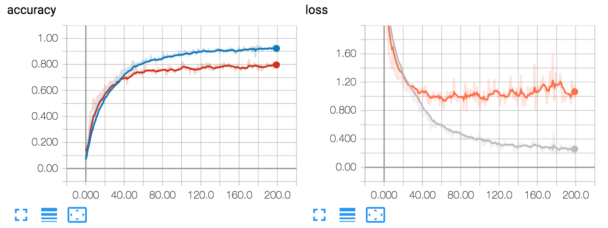
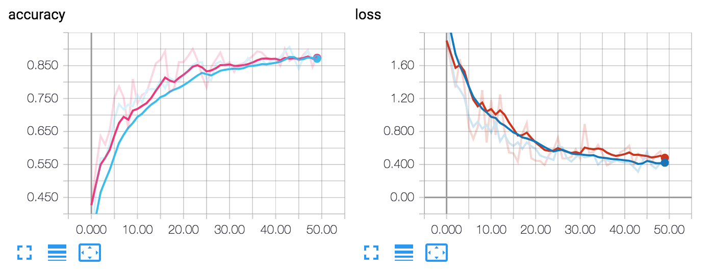

# Deep Learning for 17 Category Flower Dataset

### Environment

- PyTorch 0.4.0
- tensorboardX 1.2 (need TensorFlow installed)

### Dataset

17 Category Flower Dataset ([view](http://www.robots.ox.ac.uk/~vgg/data/flowers/17/)) consists of 1360 images of flowers with 80 in each category. The directory of data should look like ./data/[mode]/[class id]/[name].jpg for Python script running.

### Model

- For retrain: AlexNet, architecture referenced from [torchvision.models](https://github.com/pytorch/vision/blob/master/torchvision/models/alexnet.py).
- For transfer learning: pretrained ResNet-18 available in torchvision, finetune using a new fc-layer.

### Result

#### Accuracy & Loss

- retrained AlexNet: 200 epochs, learning rate = 1e-4

- finetuned ResNet: 50 epochs, learning rate = 1e-3

  

#### Test set performance

performance: accuracy over 16 * 17 test images

- retrained AlexNet: 84.93%
- finetuned ResNet: 92.65%