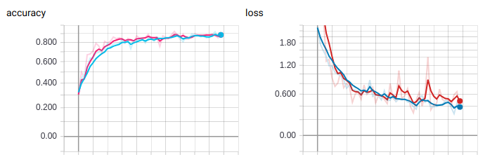

# Transfer Learning for 17 Category Flower Dataset

### Environment

- PyTorch 0.4.0
- tensorboardX 1.2 (need TensorFlow installed)

### Dataset

17 Category Flower Dataset ([view](http://www.robots.ox.ac.uk/~vgg/data/flowers/17/)) consists of 1360 images of flowers with 80 in each category. The directory of data should look like ./data/[mode]/[class id]/[name].jpg for Python script running.

### Model

Pretrained ResNet-18 available in torchvision, finetune using a new fc-layer.

### Result

#### Accuracy & Loss

#### Test set performance

91.54% accuracy over 16 * 17 test images.