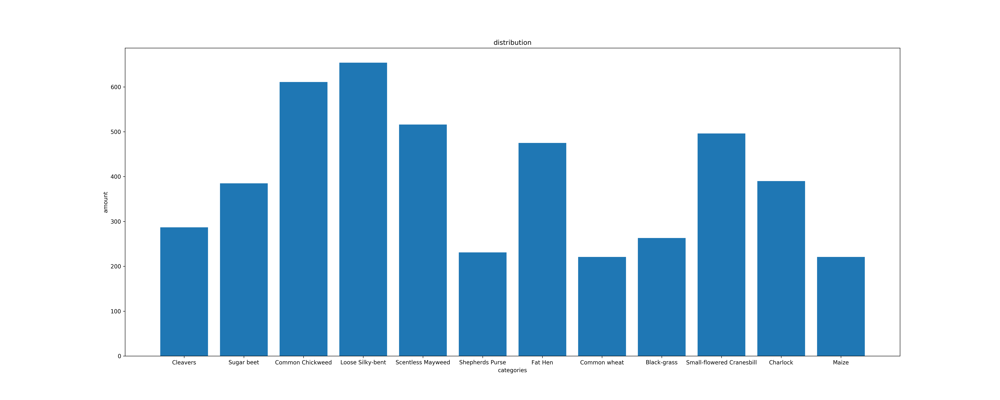

# Plant Seedlings Classification

Kaggle Competition, Playground Prediction Competition ([link](https://www.kaggle.com/c/plant-seedlings-classification))

**Determine the species of a seedling from an image**

##### Data distribution:

As can be clearly seen from the chart, the number of Loose Silky-bent is twice than the number of Shepherds Purse / Common wheat, which leads to two major approaches to process with the dataset:

- keep the train data as a constant, considering the least (221)
- split each class independently, 90% for train and 10% for validation

##### Methods

This is a typical image classification task, so ImageNet-pretrained model shall have very good performance.

- Finetuned single model (ResNet is prefered for familiarity and experience)
- classification fc by concat multi-features from different ImageNet-pretrained model's conv layers (see cfe folder for code)

##### Submits

1. 0.90617. same size of train data, epoch = 10, ResNet-50.
2. 0.93324. 90-10 split for each class data, epoch = 20, ResNet-50.
3. **0.78211**. combine conv-extracted features from AlexNet, VGGNet and ResNet, epoch = 100. the computation was **TOO SLOW**. (CFE)
4. 0.83123. learning rate = 1e-3, others are same as second submit. training was **UNSTABLE**.
5. 0.88287. learning rate = 0.0003, others are same as second submit.
6. 0.92191. learning rate = 0.00003, otheres are same as second submit (maybe need more epochs to train).
7. **0.94710**. best score ever, maye the final version. learning rate is really small to 0.00003, and epochs = 100 (maybe enough). (BEST transfer)
