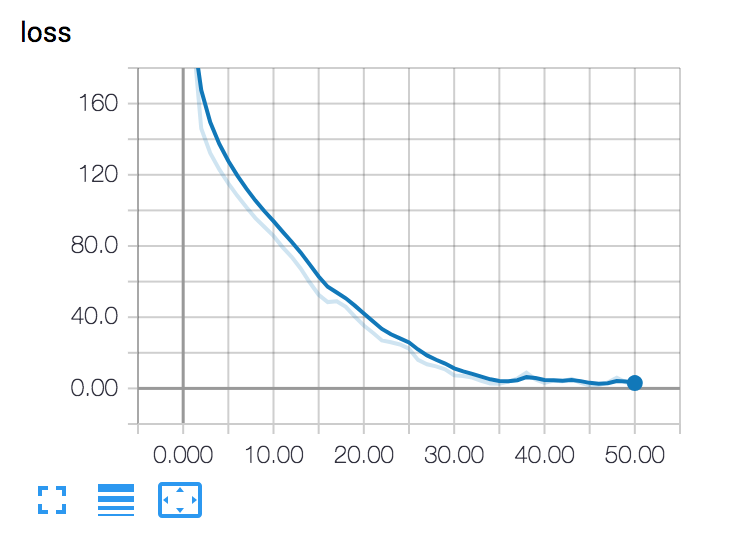

# Sentiment Analysis for Large Movie Review Dataset

### Environment

- PyTorch 0.4.0
- torchtext 0.2.3
- nltk 3.3
- tensorboardX 1.2 (need TensorFlow installed)

### Dataset

Large Movie Review Dataset ([view](http://ai.stanford.edu/~amaas/data/sentiment/), collected by Stanford University) consist of 25,000 highly polar movie reviews for training, and 25,000 for testing. It is a typical binary classification task, with labels of postive and negative for sentiment classification.

### Model

A typical Recurrent Neural Network architecture. In detailed, it is a bidirectional GRU, with hidden state size of 50. 

As for embedding, use "glove.6B.100d" from nltk (needed download), and the sequence length limit to 500. Sentences longer than 500 will be cropped to fit.

Some important-maybe hyper parameters: learning rate = 1e-3, batch size = 64, number of epoch = 50

### Result

#### Training Loss

#### Test set performance

accuracy performance: 84.68%
